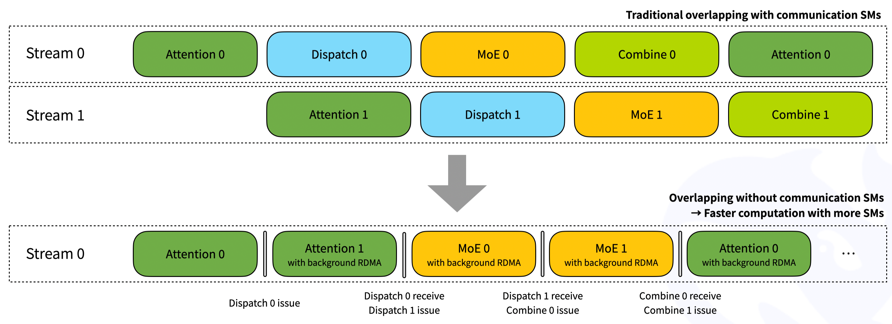

# DeepEP V1（Legacy）中文版

> **注意：** 这是 DeepEP V1（基于 NVSHMEM）的归档文档。最新的 V2 文档请参阅[主 README](../README.md)。

---

DeepEP（DeepEveryParallel）V1 是面向现代机器学习、专注于 Expert Parallelism（EP）的原始高性能通信库。它提供高吞吐、低延迟的 GPU all-to-all kernels，也称为 MoE dispatch 和 combine。该库还支持包括 FP8 在内的低精度操作。

为适配 [DeepSeek-V3](https://github.com/deepseek-ai/DeepSeek-V3) 论文提出的 group-limited gating algorithm，DeepEP V1 提供了一组针对 asymmetric-domain bandwidth forwarding 优化的 kernels，例如将数据从 NVLink domain 转发到 RDMA domain。这些 kernels 可提供高吞吐，适用于 training 和 inference prefilling 任务。此外，它们还支持 SM（Streaming Multiprocessors）数量控制。

对于对延迟敏感的 inference decoding，DeepEP V1 包含一组使用 pure RDMA 的 low-latency kernels，以尽可能降低延迟。该库还引入了一种基于 hook 的 communication-computation overlapping 方法，不占用任何 SM 资源。

请注意：本库中的实现可能与 [DeepSeek-V3](https://github.com/deepseek-ai/DeepSeek-V3) 论文存在细微差异。

## 性能

### 使用 NVLink 和 RDMA forwarding 的 normal kernels

我们在 H800 上测试 normal kernels（NVLink 最大带宽约为 160 GB/s）；每张 GPU 均连接到一张 CX7 InfiniBand 400 Gb/s RDMA 网卡（最大带宽约为 50 GB/s）。测试遵循 DeepSeek-V3/R1 的 pretraining 配置：每个 batch 4096 个 tokens、hidden size 为 7168、top-4 groups、top-8 experts、使用 FP8 dispatching 和 BF16 combining。

|   类型    | Dispatch #EP | 瓶颈带宽 | Combine #EP | 瓶颈带宽 |
|:---------:|:------------:|:--------:|:-----------:|:--------:|
| Intranode |      8       |  153 GB/s（NVLink）   |      8      |  158 GB/s（NVLink）   |
| Internode |      16      |    43 GB/s（RDMA）    |     16      |    43 GB/s（RDMA）    |
| Internode |      32      |    58 GB/s（RDMA）    |     32      |    57 GB/s（RDMA）    |
| Internode |      64      |    51 GB/s（RDMA）    |     64      |    50 GB/s（RDMA）    |

### 使用 pure RDMA 的 low-latency kernels

我们在 H800 上测试 low-latency kernels；每张 GPU 均连接到一张 CX7 InfiniBand 400 Gb/s RDMA 网卡（最大带宽约为 50 GB/s）。测试遵循典型的 DeepSeek-V3/R1 production 配置：每个 batch 128 个 tokens、hidden size 为 7168、top-8 experts、使用 FP8 dispatching 和 BF16 combining。

| Dispatch #EP | 延迟 | RDMA 带宽 | Combine #EP | 延迟 | RDMA 带宽 |
|:------------:|:----:|:---------:|:-----------:|:----:|:---------:|
|      8       |  77 us  |    98 GB/s     |      8      | 114 us  |    127 GB/s    |
|      16      | 118 us  |    63 GB/s     |     16      | 195 us  |    74 GB/s     |
|      32      | 155 us  |    48 GB/s     |     32      | 273 us  |    53 GB/s     |
|      64      | 173 us  |    43 GB/s     |     64      | 314 us  |    46 GB/s     |
|     128      | 192 us  |    39 GB/s     |     128     | 369 us  |    39 GB/s     |
|     256      | 194 us  |    39 GB/s     |     256     | 360 us  |    40 GB/s     |

## 快速开始

### 环境要求

- Ampere（SM80）、Hopper（SM90）GPU，或支持 SM90 PTX ISA 的其他架构
- Python 3.8 及以上
- CUDA 版本
    - SM80 GPU 需要 CUDA 11.0 及以上
    - SM90 GPU 需要 CUDA 12.3 及以上
- PyTorch 2.1 及以上
- Intranode 通信需要 NVLink
- Internode 通信需要 RDMA network

### 下载并安装 NVSHMEM 依赖

DeepEP V1 依赖 NVSHMEM。安装说明请参阅 NVSHMEM Installation Guide。

### 开发

```bash
# 构建并为 SO 文件创建 symbolic links
NVSHMEM_DIR=/path/to/installed/nvshmem python setup.py build
# 可根据自己的 platform 修改具体的 SO 文件名
ln -s build/lib.linux-x86_64-cpython-38/deep_ep_cpp.cpython-38-x86_64-linux-gnu.so

# 运行测试用例
# 注意：你可能需要根据自己的 cluster 配置修改 `tests/utils.py` 中的 `init_dist` 函数，
# 并在多个节点上启动测试
python tests/test_intranode.py
python tests/test_internode.py
python tests/test_low_latency.py
```

### 安装

```bash
NVSHMEM_DIR=/path/to/installed/nvshmem python setup.py install
```

#### 安装环境变量

- `NVSHMEM_DIR`：NVSHMEM 目录的路径；如果未指定，则禁用所有 internode 和 low-latency 功能
- `DISABLE_SM90_FEATURES`：取值为 0 或 1，用于指定是否禁用 SM90 features；对于 SM90 devices 或 CUDA 11，这是必需的配置
- `TORCH_CUDA_ARCH_LIST`：目标架构列表，例如 `TORCH_CUDA_ARCH_LIST="9.0"`
- `DISABLE_AGGRESSIVE_PTX_INSTRS`：取值为 0 或 1，用于指定是否禁用 aggressive load/store instructions；详情请参阅[Undefined-behavior PTX usage](#undefined-behavior-ptx-usage)

## 网络配置

DeepEP 已在 InfiniBand networks 上完成全面测试。不过从理论上讲，它也兼容 RDMA over Converged Ethernet（RoCE）。

### 流量隔离

InfiniBand 通过 Virtual Lanes（VL）支持 traffic isolation。

为了避免不同类型的流量相互干扰，我们建议将 workload 按以下类别分配到不同的 virtual lanes 中：

- 使用 normal kernels 的 workloads
- 使用 low-latency kernels 的 workloads
- 其他 workloads

对于 DeepEP V1，可以通过设置 `NVSHMEM_IB_SL` environment variable 控制 virtual lane 的分配。

### 自适应路由

Adaptive routing 是 InfiniBand switches 提供的高级 routing feature，可以将流量均匀分布到多条路径上。启用 adaptive routing 可以完全消除由 routing conflicts 导致的 network congestion，但也会引入额外延迟。为获得最佳性能，我们建议使用以下配置：

- 在 network load 较高的环境中启用 adaptive routing
- 在 network load 较低的环境中使用 static routing

### 拥塞控制

由于我们在 production environment 中没有观察到明显的 congestion，因此 congestion control 处于禁用状态。

## 接口与示例

### 在 model training 或 inference prefilling 中使用的示例

如下方示例代码所示，normal kernels 可用于 model training 或 inference prefilling 阶段（不包含 backward 部分）。

```python
import torch
import torch.distributed as dist
from typing import List, Tuple, Optional, Union

from deep_ep import Buffer, EventOverlap

# Communication buffer（运行时分配）
_buffer: Optional[Buffer] = None

# 设置要使用的 SM 数量
# 注意：这是一个 static variable
Buffer.set_num_sms(24)


# 可以在 framework initialization 时调用此函数
def get_buffer(group: dist.ProcessGroup, hidden_bytes: int) -> Buffer:
    global _buffer

    # 注意：也可以通过运行所有测试，使用 auto-tuned 结果替换 `get_*_config`
    num_nvl_bytes, num_rdma_bytes = 0, 0
    for config in (Buffer.get_dispatch_config(group.size()), Buffer.get_combine_config(group.size())):
        num_nvl_bytes = max(config.get_nvl_buffer_size_hint(hidden_bytes, group.size()), num_nvl_bytes)
        num_rdma_bytes = max(config.get_rdma_buffer_size_hint(hidden_bytes, group.size()), num_rdma_bytes)

    # 如果 buffer 不存在或容量不足，则分配一个 buffer
    if _buffer is None or _buffer.group != group or _buffer.num_nvl_bytes < num_nvl_bytes or _buffer.num_rdma_bytes < num_rdma_bytes:
        _buffer = Buffer(group, num_nvl_bytes, num_rdma_bytes)
    return _buffer


def get_hidden_bytes(x: torch.Tensor) -> int:
    t = x[0] if isinstance(x, tuple) else x
    return t.size(1) * max(t.element_size(), 2)


def dispatch_forward(x: Union[torch.Tensor, Tuple[torch.Tensor, torch.Tensor]],
                     topk_idx: torch.Tensor, topk_weights: torch.Tensor,
                     num_experts: int, previous_event: Optional[EventOverlap] = None) -> \
        Tuple[Union[torch.Tensor, Tuple[torch.Tensor, torch.Tensor]], torch.Tensor, torch.Tensor, List, Tuple, EventOverlap]:
    # 注意：可选的 `previous_event` 表示一个 CUDA event；该 event 会被捕获，并作为 dispatch kernel 的依赖项。
    # 在 communication-computation overlap 场景中可能会用到它。详情请参阅 `Buffer.dispatch` 的文档。
    global _buffer

    # 在实际 dispatch 之前计算 layout
    num_tokens_per_rank, num_tokens_per_rdma_rank, num_tokens_per_expert, is_token_in_rank, previous_event = \
        _buffer.get_dispatch_layout(topk_idx, num_experts,
                                    previous_event=previous_event, async_finish=True,
                                    allocate_on_comm_stream=previous_event is not None)
    # 执行 MoE dispatch
    # 注意：CPU 会等待 GPU 发来的 signal，因此这与 CUDA graph 不兼容。
    # 除非指定 `num_worst_tokens`，但该 flag 仅适用于 intranode。
    # 如需更高级的用法，请参阅 `dispatch` 函数的文档。
    recv_x, recv_topk_idx, recv_topk_weights, num_recv_tokens_per_expert_list, handle, event = \
        _buffer.dispatch(x, topk_idx=topk_idx, topk_weights=topk_weights,
                         num_tokens_per_rank=num_tokens_per_rank, num_tokens_per_rdma_rank=num_tokens_per_rdma_rank,
                         is_token_in_rank=is_token_in_rank, num_tokens_per_expert=num_tokens_per_expert,
                         previous_event=previous_event, async_finish=True,
                         allocate_on_comm_stream=True)
    # 关于 event 管理，请参阅 `EventOverlap` class 的文档。
    return recv_x, recv_topk_idx, recv_topk_weights, num_recv_tokens_per_expert_list, handle, event


def dispatch_backward(grad_recv_x: torch.Tensor, grad_recv_topk_weights: torch.Tensor, handle: Tuple) -> \
        Tuple[torch.Tensor, torch.Tensor, EventOverlap]:
    global _buffer

    # MoE dispatch 的 backward 过程实际上是 combine
    # 如需更高级的用法，请参阅 `combine` 函数的文档。
    combined_grad_x, combined_grad_recv_topk_weights, event = \
        _buffer.combine(grad_recv_x, handle, topk_weights=grad_recv_topk_weights, async_finish=True)

    # 关于 event 管理，请参阅 `EventOverlap` class 的文档。
    return combined_grad_x, combined_grad_recv_topk_weights, event


def combine_forward(x: torch.Tensor, handle: Tuple, previous_event: Optional[EventOverlap] = None) -> \
        Tuple[torch.Tensor, EventOverlap]:
    global _buffer

    # 执行 MoE combine
    # 如需更高级的用法，请参阅 `combine` 函数的文档。
    combined_x, _, event = _buffer.combine(x, handle, async_finish=True, previous_event=previous_event,
                                           allocate_on_comm_stream=previous_event is not None)

    # 关于 event 管理，请参阅 `EventOverlap` class 的文档。
    return combined_x, event


def combine_backward(grad_combined_x: Union[torch.Tensor, Tuple[torch.Tensor, torch.Tensor]],
                     handle: Tuple, previous_event: Optional[EventOverlap] = None) -> \
        Tuple[Union[torch.Tensor, Tuple[torch.Tensor, torch.Tensor]], EventOverlap]:
    global _buffer

    # MoE combine 的 backward 过程实际上是 dispatch
    # 如需更高级的用法，请参阅 `dispatch` 函数的文档。
    grad_x, _, _, _, _, event = _buffer.dispatch(grad_combined_x, handle=handle, async_finish=True,
                                                 previous_event=previous_event,
                                                 allocate_on_comm_stream=previous_event is not None)

    # 关于 event 管理，请参阅 `EventOverlap` class 的文档。
    return grad_x, event
```

此外，在 dispatch function 内部，我们可能不知道当前 rank 需要接收多少 tokens。因此，如下图所示，系统会隐式地让 CPU 等待 GPU 发来的 received-count signal。


### 在 inference decoding 中使用的示例

如下方示例代码所示，low-latency kernels 可用于 inference decoding 阶段。

```python
import torch
import torch.distributed as dist
from typing import Tuple, Optional

from deep_ep import Buffer

# Communication buffer（运行时分配）
# 注意：low-latency kernels 没有 SM control API
_buffer: Optional[Buffer] = None


# 可以在 framework initialization 时调用此函数
def get_buffer(group: dist.ProcessGroup, num_max_dispatch_tokens_per_rank: int, hidden: int, num_experts: int) -> Buffer:
    # 注意：low-latency mode 消耗的空间远多于 normal mode
    # 因此建议 `num_max_dispatch_tokens_per_rank`（decoding engine 中的实际 batch size）小于 256
    global _buffer
    num_rdma_bytes = Buffer.get_low_latency_rdma_size_hint(num_max_dispatch_tokens_per_rank, hidden, group.size(), num_experts)

    # 如果 buffer 不存在或容量不足，则分配一个 buffer
    if _buffer is None or _buffer.group != group or not _buffer.low_latency_mode or _buffer.num_rdma_bytes < num_rdma_bytes:
        # 注意：为获得最佳性能，QP number **必须**等于 local experts 的数量
        assert num_experts % group.size() == 0
        _buffer = Buffer(group, 0, num_rdma_bytes, low_latency_mode=True, num_qps_per_rank=num_experts // group.size())
    return _buffer


def low_latency_dispatch(hidden_states: torch.Tensor, topk_idx: torch.Tensor, num_max_dispatch_tokens_per_rank: int, num_experts: int):
    global _buffer

    # 执行 MoE dispatch，兼容 CUDA graph（但 replay 时可能需要恢复部分 buffer 状态）
    recv_hidden_states, recv_expert_count, handle, event, hook = \
        _buffer.low_latency_dispatch(hidden_states, topk_idx, num_max_dispatch_tokens_per_rank, num_experts,
                                     async_finish=False, return_recv_hook=True)

    # 注意：只有调用 `hook()` 后才会真正接收 tensor；
    # 这对 double-batch overlapping 很有用，而且 **不会占用任何 SM**。
    # 如果不需要 overlap，请设置 `return_recv_hook=False`。
    # 后续可以使用我们的 GEMM library，处理这种特定 format 的数据。
    return recv_hidden_states, recv_expert_count, handle, event, hook


def low_latency_combine(hidden_states: torch.Tensor,
                        topk_idx: torch.Tensor, topk_weights: torch.Tensor, handle: Tuple):
    global _buffer

    # 执行 MoE combine，兼容 CUDA graph（但 replay 时可能需要恢复部分 buffer 状态）
    combined_hidden_states, event_overlap, hook = \
        _buffer.low_latency_combine(hidden_states, topk_idx, topk_weights, handle,
                                    async_finish=False, return_recv_hook=True)

    # 注意：行为与 dispatch kernel 中的描述相同
    return combined_hidden_states, event_overlap, hook
```

关于 two-micro-batch overlapping，可以参考下图。借助 receiving hook interface，RDMA network traffic 会在后台进行，不会占用 computation 部分的 GPU SM。但请注意，overlap 的各部分可以进行调整，即 attention、dispatch、MoE、combine 这 4 个部分的执行时间不一定完全相同。你可以根据自己的 workload 调整 stage settings。



## Roadmap（V1）

- [x] AR support
- [x] 重构 low-latency mode 的 AR code
- [x] A100 support（仅 intranode）
- [x] 支持 low-latency dispatch kernel 使用 BF16
- [x] 支持 intranode low-latency kernels 使用 NVLink protocol
- [ ] 使用 TMA copy 替代 LD/ST
    - [x] Intranode kernels
    - [ ] Internode kernels
    - [ ] Low-latency kernels
- [ ] SM-free kernels 和重构
- [ ] 完全移除 undefined-behavior PTX instructions

## 注意事项

#### 更简单的潜在整体设计

V1 实现使用 queues 作为 communication buffers，这样可以节省内存，但会增加复杂度并可能导致 deadlocks。如果你基于 DeepEP V1 实现自己的版本，可以考虑使用预先分配到最大容量的 fixed-size buffers，以获得更简单的实现和更好的性能。关于这种替代方案的详细讨论，请参阅 https://github.com/deepseek-ai/DeepEP/issues/39。

#### Undefined-behavior PTX usage

- 为了获得极致性能，我们发现并使用了一种 undefined-behavior PTX usage：使用只读 PTX `ld.global.nc.L1::no_allocate.L2::256B` **读取 volatile data**。PTX modifier `.nc` 表示使用 non-coherent cache。但测试表明，在 Hopper architectures 上配合 `.L1::no_allocate` 可以保证 correctness，并且性能会明显更好。我们推测原因可能是：non-coherent cache 与 L1 统一，而 L1 modifier 不只是 hint，而是一个强制选项，因此 L1 中没有 dirty data 时可以保证 correctness。
- 起初，由于 NVCC 无法自动展开 volatile read PTX，我们尝试使用 `__ldg`（即 `ld.nc`）。与手动展开的 volatile reads 相比，它的速度明显更快（可能是因为额外的 compiler optimizations）。但是，结果可能不正确，或者可能读到 dirty data。在查阅 PTX documentation 后，我们发现 Hopper architectures 上的 L1 与 non-coherent cache 是统一的。我们推测 `.L1::no_allocate` 可能可以解决这个问题，于是有了上述发现。
- 如果你发现 kernels 在其他 platform 上无法正常工作，可以在 `setup.py` 中添加 `DISABLE_AGGRESSIVE_PTX_INSTRS=1` 来禁用该功能，或者提交 issue。

#### 在你的 cluster 上进行 auto-tuning

为了在你的 cluster 上获得更好的性能，我们建议运行所有测试，并使用最佳的 auto-tuned configuration。默认 configuration 针对 DeepSeek 的 internal cluster 进行了优化。
